# Project alieze-erp

One Paragraph of project description goes here

## Database Migration Overview

The project includes a database schema files covering:

### Core System (Foundation)
- **Multi-tenancy**: Organizations, users, companies
- **Reference data**: Countries, currencies, units of measure
- **Authentication**: User management and permissions

### Business Modules
- **CRM**: Contacts, leads, sales teams, activities
- **Products & Inventory**: Product catalog, warehouses, stock management
- **Sales**: Pricelists, orders, order lines
- **Accounting**: Chart of accounts, invoices, payments, taxes
- **Purchasing & Manufacturing**: Purchase orders, BOMs, work orders
- **Delivery Tracking**: Vehicles, routes, shipments, tracking
- **Point of Sale**: POS configuration, sessions, payments

### Advanced Features
- **Knowledge Base**: Articles, revisions, tagging system
- **AI Integration**: AI agents, insights, model configuration
- **Data Import**: Import sessions, templates, history
- **Permissions**: Granular role-based access control
- **Analytics**: Business insights, financial analysis, growth metrics

### Technical Infrastructure
- **Queue System**: Job processing and handlers
- **Search**: Global semantic search, duplicate detection
- **Security**: Row-level security, data privacy, audit logging
- **Integration**: Multiple AI provider support

## Architecture Diagram

```mermaid
graph TD
    %% Core System
    organizations[organizations] -->|has many| organization_users[organization_users]
    organizations -->|has many| companies[companies]
    companies -->|has many| sequences[sequences]

    %% Reference Data
    countries[countries] -->|has many| states[states]
    currencies[currencies] -->|used by| organizations
    uom_categories[uom_categories] -->|has many| uom_units[uom_units]

    %% CRM Module
    companies -->|has many| contacts[contacts]
    contacts -->|has many| activities[activities]
    companies -->|has many| leads[leads]
    leads -->|belongs to| lead_stages[lead_stages]
    leads -->|belongs to| lead_sources[lead_sources]
    contacts -->|tagged with| contact_tags[contact_tags]

    %% Products & Inventory
    companies -->|has many| product_categories[product_categories]
    product_categories -->|has many| products[products]
    products -->|has many| product_variants[product_variants]
    companies -->|has many| warehouses[warehouses]
    warehouses -->|has many| stock_locations[stock_locations]
    stock_locations -->|contains| stock_quants[stock_quants]
    products -->|tracked in| stock_quants

    %% Sales Module
    companies -->|has many| pricelists[pricelists]
    contacts -->|places| sales_orders[sales_orders]
    sales_orders -->|contains| sales_order_lines[sales_order_lines]
    sales_order_lines -->|references| products
    sales_order_lines -->|uses| pricelists

    %% Accounting Module
    companies -->|has many| account_accounts[account_accounts]
    account_accounts -->|organized in| account_groups[account_groups]
    account_accounts -->|belongs to| account_account_types[account_account_types]
    companies -->|has many| account_journals[account_journals]
    sales_orders -->|generates| invoices[invoices]
    invoices -->|contains| invoice_lines[invoice_lines]
    invoices -->|paid by| payments[payments]
    invoice_lines -->|uses| account_taxes[account_taxes]
    account_taxes -->|grouped in| account_tax_groups[account_tax_groups]

    %% Purchasing & Manufacturing
    companies -->|creates| purchase_orders[purchase_orders]
    purchase_orders -->|contains| purchase_order_lines[purchase_order_lines]
    companies -->|has| workcenters[workcenters]
    companies -->|creates| bom_bills[bom_bills]
    bom_bills -->|contains| bom_lines[bom_lines]
    bom_bills -->|used in| manufacturing_orders[manufacturing_orders]
    manufacturing_orders -->|broken into| work_orders[work_orders]

    %% HR Structure
    companies -->|has| departments[departments]
    departments -->|has| job_positions[job_positions]
    job_positions -->|uses| resources[resources]

    %% Delivery Tracking
    companies -->|owns| delivery_vehicles[delivery_vehicles]
    delivery_vehicles -->|assigned to| delivery_routes[delivery_routes]
    delivery_routes -->|has| delivery_route_stops[delivery_route_stops]
    delivery_routes -->|tracked by| delivery_route_positions[delivery_route_positions]
    delivery_routes -->|contains| delivery_shipments[delivery_shipments]
    delivery_shipments -->|has| delivery_tracking_events[delivery_tracking_events]

    %% Point of Sale
    companies -->|configures| pos_config[pos_config]
    pos_config -->|uses| pos_payment_methods[pos_payment_methods]
    pos_config -->|has| pos_sessions[pos_sessions]
    pos_sessions -->|contains| pos_payments[pos_payments]
    pos_sessions -->|applies| pos_order_discounts[pos_order_discounts]
    pos_sessions -->|generates| pos_inventory_alerts[pos_inventory_alerts]
    pos_sessions -->|uses| pos_pricing_overrides[pos_pricing_overrides]

    %% Knowledge Base
    companies -->|has| knowledge_spaces[knowledge_spaces]
    knowledge_spaces -->|contains| knowledge_entries[knowledge_entries]
    knowledge_entries -->|has| knowledge_entry_revisions[knowledge_entry_revisions]
    knowledge_entries -->|tagged with| knowledge_tags[knowledge_tags]
    knowledge_entries -->|linked via| knowledge_entry_tags[knowledge_entry_tags]
    knowledge_entries -->|linked to| knowledge_context_links[knowledge_context_links]
    knowledge_entries -->|has| knowledge_entry_assets[knowledge_entry_assets]

    %% AI Integration
    companies -->|has| ai_team_members[ai_team_members]
    ai_team_members -->|performs| ai_agent_tasks[ai_agent_tasks]
    ai_agent_tasks -->|generates| ai_agent_insights[ai_agent_insights]
    users[users] -->|has| ai_user_preferences[ai_user_preferences]
    companies -->|configures| ai_model_config[ai_model_config]
    ai_model_config -->|uses| ai_provider_routing_rules[ai_provider_routing_rules]

    %% Permissions System
    companies -->|defines| permission_roles[permission_roles]
    permission_roles -->|inherits from| permission_role_inheritance[permission_role_inheritance]
    permission_roles -->|based on| permission_role_templates[permission_role_templates]
    users -->|assigned to| user_role_assignments[user_role_assignments]
    companies -->|organizes| permission_groups[permission_groups]
    permission_roles -->|has| role_permission_groups[role_permission_groups]
    companies -->|defines| permission_table_policies[permission_table_policies]
    companies -->|defines| permission_column_policies[permission_column_policies]
    companies -->|defines| permission_row_filters[permission_row_filters]
    companies -->|defines| ai_data_permissions[ai_data_permissions]
    ai_data_permissions -->|uses| ai_context_rules[ai_context_rules]
    ai_data_permissions -->|uses| ai_sanitization_rules[ai_sanitization_rules]
    ai_data_permissions -->|logs to| ai_data_access_log[ai_data_access_log]
    permission_roles -->|logs to| permission_audit_log[permission_audit_log]
```



This Mermaid diagram shows the key entity relationships in the ERP system. The architecture follows a multi-tenant pattern where most business entities belong to companies, which in turn belong to organizations. Core business processes like CRM, Sales, Accounting, and Inventory are interconnected through these relationships.

## Getting Started

These instructions will get you a copy of the project up and running on your local machine for development and testing purposes. See deployment for notes on how to deploy the project on a live system.

## MakeFile

Run build make command with tests
```bash
make all
```

Build the application
```bash
make build
```

Run the application
```bash
make run
```
Create DB container
```bash
make docker-run
```

Shutdown DB Container
```bash
make docker-down
```

DB Integrations Test:
```bash
make itest
```

Live reload the application:
```bash
make watch
```

Run the test suite:
```bash
make test
```

Clean up binary from the last build:
```bash
make clean
```
